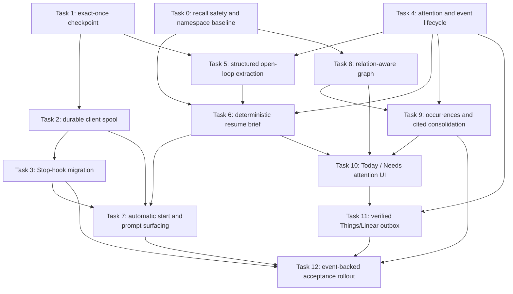

# Clio Dependable Workflow Memory Implementation Plan

> **For agentic workers:** Implement this plan task by task. Each task is an independently testable and committable stopping point. Do not begin in the current dirty checkout; satisfy the execution precondition below first.

**Goal:** Make Clio dependable enough to carry more of Danny's workflow memory automatically: capture decisions and open loops without silent loss, resurface them at the next useful moment with evidence and a reason, preserve decision history, and hand user-owned work to Things or Linear only when delivery can be proved.

**Source:** [`docs/clio-engine-usefulness-report.md`](../../clio-engine-usefulness-report.md), written from the 29 July 2026 repository, installed-hook and read-only Atlas snapshot. The report is the product brief; this document turns it into dependency-ordered implementation work.

**Architecture:** SQLite and `clio-core` remain authoritative for memory, attention, checkpoint, event, graph and consolidation semantics. CLI, MCP, daemon and Tauri remain thin adapters. The installed `clio-hooks` package owns client-local transcript parsing, redaction and the durable file spool because Atlas is remote and the local daemon is disabled. Things and Linear remain operational queues; Clio retains context, attention state and audit evidence.

**Tech stack:** Rust, `rusqlite`/SQLite, clap CLI, rmcp MCP server, Python standard-library hook scripts, Tauri 2, Vue 3 and TypeScript.

**Overall size and confidence:** **XL**, delivered as four usable slices. Confidence is **high** through automatic follow-up capture and surfacing, **medium-high** for cited consolidation, and **medium** for relationship classification and external Things/Linear read-back until their live contracts are proved.

## Current state

- The core already provides durable memories, source/source-ref upsert, exact-content capture deduplication, review queueing, receipts, handoff briefs, scoped keyword and semantic recall, character budgets, typed links, consolidation and remote Atlas routing. Extend these paths; do not recreate them.
- `capture::distill_and_store` extracts multiple atoms but stores them one by one. A retry is not a durable checkpoint and a middle failure can leave a partial session.
- The active Claude and Codex Stop hooks claim a whole session with a permanent `.done` marker before remote/model work finishes. Later Stop events and failed attempts can therefore disappear.
- Codex redaction protects diagnostic output, not the actual provider/spool payload. Claude has no shared equivalent.
- Memories have no operational attention lifecycle. The observed Atlas snapshot had 654 receipts but only two task memories, both already completed and still active.
- `repository::append_linked_memories` follows outgoing links only, drops relationship details and batch-loads targets without reapplying archive/expiry filters.
- Consolidation is a derived singleton, but its freshness is based on newly created rows rather than every relevant mutation and its claims do not cite source IDs.
- The tracked [`.clio-namespace`](../../../.clio-namespace) is `clio`; the Atlas snapshot also contained `project:clio`. The tracked marker is the conservative canonical identity for this repository.
- Claude SessionStart currently calls `~/.claude/hooks/clio-session-recall.sh`, not the richer installed `session_start.py`. Codex has no Clio SessionStart injection. Both clients already have other SessionStart, Stop and UserPromptSubmit hooks which must be preserved.
- The hook package's `clio_report.py`, `docs/metrics.md` and `docs/roadmap.md` describe older outcome names and cannot yet prove usefulness without changing `access_count`.
- The Vue app has no automated test runner. Rust tests and `npm run build` are available; user-facing Tauri behaviour needs a real local and Atlas-mode check.

### Execution precondition

The authoring checkout currently contains 24 unrelated changes for capture-model settings, OpenAI capabilities and the Tauri Settings view. They overlap `capture.rs`, `lib.rs`, CLI, Tauri registration, API types, router, sidebar and documentation.

Before Task 0:

1. let that work land on `develop`, or create an isolated worktree from the resulting commit;
2. confirm `git status --short` is clean in the implementation worktree;
3. rerun the focused baseline tests named below;
4. recheck the next migration number (it is `009` at authoring time); and
5. capture fresh, non-mutating Atlas and hook-health baselines because the report values are a snapshot, not permanent facts.

Do not reset, move or absorb the current uncommitted work to satisfy this precondition.

## Decisions and conservative defaults

| Decision | First-release default | Upgrade trigger |
| --- | --- | --- |
| Clio's role | Memory and attention ledger only. No assignment, estimation, sprint or scheduling workflow. | Revisit only if Things/Linear cannot express an evidenced operational need. |
| Canonical Clio namespace | Keep the tracked `clio` marker and review-merge `project:clio` into it after backup and count checks. No alias table. | Add aliases only if correctly configured clients recreate a split after reconciliation. |
| Automatic action capture | Explicit user commitments and explicit promised follow-ups may open attention automatically. Suggestions and inferred work go to the existing review inbox. | Loosen only after annotated precision is acceptable. |
| Completion | Never infer completion from similarity. Require an explicit action call, stable external status or reviewed resolution evidence. | Add automatic matching only after false-resolution tests and an approval flow exist. |
| Undated resurfacing | Show at the next relevant project session and in Today. No daily digest or OS notification initially. | Add a digest only if event data shows relevant items are waiting too long. |
| Reminder repetition | At most once per session/topic unless due state or evidence changes. Every reminder says why it appeared. | Tune from dismissal and acted-on rates. |
| Automatic retrieval metrics | Automatic injection records an event but does not increment `access_count` or refresh ranking age. | None; this is a trust invariant. |
| Cross-project links | Review-only. Global preferences may be retrieved with a modest prior but are not silently linked. | Permit an exception only after an explicit policy and false-link baseline. |
| Machine-created links | Existing automatic persistence remains `auto:relates_to`. A classifier may propose a typed relation but cannot accept it. | Allow low-risk auto-acceptance only after measured precision and an undo path. |
| External handoff | One-tap approval first. Never create Things/Linear work from speculative suggestions. | Optional auto-send only for explicit user-owned actions after delivery accuracy is demonstrated. |
| External authority | A verified external item is authoritative for execution state. Clio remains authoritative for capture context and audit. Unverified disagreement stays visible. | No silent last-write-wins policy. |
| Successful spool retention | Delete the redacted payload immediately after a confirmed checkpoint; retain only non-sensitive health metadata. | None. |
| Failed spool retention | Retain redacted pending/dead-letter payloads until success or explicit purge. Use `0700` directories and `0600` files. | If this privacy trade-off is unacceptable, encryption at rest is a gate before Task 2. |
| Background processing | Drain on enqueue, SessionStart, Tauri start and explicit command. Do not add a LaunchAgent yet. | Add one only if measured oldest-pending latency remains unacceptable. |

## Global invariants

- Archive means hidden, not deleted. Archived, expired, resolved and superseded records must not re-enter default recall through graph expansion or consolidation.
- Tags and FTS data remain synchronised through the existing write paths and triggers.
- Upserts keyed by `source + source_ref` remain idempotent; checkpoint idempotency is additional and must not weaken this rule.
- A capture attempt ends in exactly one visible state: durable success, pending retry or terminal failure. It must never disappear silently.
- Provider calls, embeddings and external API calls occur outside SQLite write transactions.
- A checkpoint stores all accepted memories, review items, attention mutations and its completion record atomically, including an intentionally empty result.
- Access/event tracking is fire-and-forget and cannot fail recall, resume or action operations.
- `decay_lambda = 0.0` preserves existing ranking behaviour.
- Auto-created persisted links retain the `auto:` prefix.
- Consolidation is derived, source-cited and replaceable. It cannot silently resolve contradictions or overwrite decision history.
- External delivery is not successful until read-back verifies the stable external ID. A failed handoff leaves the Clio attention item open.
- CLI, MCP and Tauri defaults match core semantics. Machine-local hook queue commands must not accidentally route their files to Atlas.
- Every schema change is an additive migration. Never edit migrations `001` through `008`.
- Redaction applies to the exact payload written to disk and sent to the provider, not a diagnostic copy.
- Existing Claude/Codex hooks remain installed alongside Clio hooks; registration edits may add or replace only the Clio entries.
- Documentation and user-facing text use British English.

## Dependency map

Safe parallelism after contracts are fixed:

- Task 2's external hook package can be developed against Task 1's frozen CLI fixture while Task 1 is implemented.
- Task 8 can proceed after Task 0 without touching checkpoint/attention files.
- Task 10 design can begin after Task 6's DTO is fixed, but Tauri integration waits for Tasks 8 and 9.
- Do not parallelise tasks which edit `capture.rs`, `migrations.rs`, `clio-cli/src/main.rs` or `clio-mcp/src/main.rs` without explicit file ownership.

## Delivery phases

### Phase 0 — Remove known trust hazards

### Task 0 — Keep hidden linked memories hidden and establish one namespace

**Depends on:** Execution precondition only.

**Size:** S.

**Files:**

- Create: none.
- Modify: `crates/clio-core/src/repository.rs`.
- Tests: `crates/clio-core/tests/integration.rs`.
- External: reviewed Atlas namespace reconciliation using existing `repository::rename_namespace` / Tauri `cmd_merge_namespaces`; no raw SQL.

**Existing code to reuse:** `append_linked_memories`, `get_many`, `RecallQuery::exclude_expired`, `cmd_merge_namespaces`, the tracked `.clio-namespace`, and the existing Atlas backup command/runbook.

**Contract changes:** Default linked expansion now applies the same archive and expiry eligibility as the parent recall. The public result shape remains compatible in this task.

**Schema or migration:** None.

**Failure behaviour:** A linked-target lookup error still fails the requested recall with an actionable storage error. Access tracking remains fire-and-forget. Namespace reconciliation stops before mutation if backup, source count, target count or duplicate preview cannot be verified.

- [ ] Extend `recall_with_include_links_appends_linked_memories` with archived and expired target cases which currently fail because those targets reappear.
- [ ] Add a characterisation test proving an explicitly requested archived recall still works.
- [ ] Run `cargo test -p clio-core recall_with_include_links -- --nocapture` and record the expected failure.
- [ ] Change the shared linked-memory load path once so every caller reapplies archive/expiry eligibility; do not add caller-specific guards.
- [ ] Run `cargo test -p clio-core recall_with_include_links` and `cargo test -p clio-core bulk_link_expansion`.
- [ ] Exercise the real behaviour against a disposable local database: link an active memory to archived and expired targets and confirm default recall omits both.
- [ ] Back up Atlas, capture `clio` and `project:clio` counts, preview duplicate source references, and request explicit approval before the live merge into `clio`.
- [ ] Verify post-merge total counts and representative recall; leave the backup intact until the programme acceptance gate.
- [ ] Commit the code independently as `fix(core): keep hidden linked memories out of recall`.

**Finished when:** Graph expansion cannot bypass archive/expiry rules, and the live reconciliation is either verified complete or explicitly recorded as a gated operational step with no data mutation claimed.

**Rollback or recovery:** Revert the code commit for result behaviour. Restore the pre-merge Atlas backup only if count/evidence verification fails; do not attempt ad hoc reverse SQL.

### Phase 1 — Trust capture

### Task 1 — Add an exact-once server checkpoint

**Depends on:** Task 0 code can be independent, but the execution precondition and migration-number recheck are mandatory.

**Size:** M.

**Files:**

- Create: `crates/clio-core/src/checkpoint.rs`.
- Modify: `crates/clio-core/src/migrations.rs`, `crates/clio-core/src/capture.rs`, `crates/clio-core/src/lib.rs`, `crates/clio-cli/src/main.rs`, `crates/clio-mcp/src/main.rs`, `docs/reference/schema.md`, `docs/reference/mcp-contract.md`, `docs/cli-reference.md`, `context/ARCHITECTURE.md`, `context/DOMAIN_RULES.md`.
- Tests: inline tests in `checkpoint.rs`; `crates/clio-core/tests/multi_connection.rs`; existing capture, CLI and MCP tests.
- External: none.

**Existing code to reuse:** `distill_with_usage`, `store_or_queue`, `review::approve_review` transaction/savepoint pattern, `db::finish_transaction`, `db::rollback_transaction`, `command_uses_shared_storage`, and `remote_mcp::run_cli` routing.

**Contract changes:** Add `clio checkpoint` and MCP `memory_session_checkpoint`. Inputs include agent/source, session ID, monotonic transcript cursor, namespace/cwd context, branch/ticket identifiers and redacted digest. The stable key is derived from source + session + cursor. Existing `clio distill` remains compatible.

**Schema or migration:** Add the next migration, expected `009_session_checkpoints`, with a unique `(source, session_id, cursor)` identity and stored result envelope. Store result IDs/counts and timestamps, never transcript text or secrets.

**Failure behaviour:** Check for a completed key before calling the model, then recheck inside `BEGIN IMMEDIATE`. Provider and embedding work never occurs inside the write transaction. Any atom/review/checkpoint failure rolls back all durable writes. A lost response can replay the stored result. An empty extraction is a successful checkpoint and is not redistilled.

- [ ] Write core tests for first checkpoint, same-key replay, a later cursor, a successful empty result and a forced middle-write rollback.
- [ ] Add a multi-connection race test based on `simultaneous_upserts_with_the_same_source_reference_are_idempotent`.
- [ ] Run `cargo test -p clio-core checkpoint -- --nocapture` and record failures showing no checkpoint contract exists.
- [ ] Split model extraction from transactional atom storage. Keep post-commit auto-embedding best-effort and outside the transaction.
- [ ] Implement preflight lookup, in-transaction recheck, atomic store and result replay in `checkpoint.rs`.
- [ ] Add the thin CLI and MCP adapters with matching defaults and actionable configuration/storage errors.
- [ ] Run `cargo test -p clio-core checkpoint`, `cargo test -p clio-core --test multi_connection`, `cargo test -p clio-cli checkpoint` and `cargo test -p clio-mcp session_checkpoint`.
- [ ] Exercise the real behaviour with a temporary database: submit one fixture twice and confirm one checkpoint and one set of atoms; kill the client after commit and confirm replay returns the same IDs.
- [ ] Update schema, CLI, MCP, architecture and domain contracts.
- [ ] Commit independently as `feat(capture): add idempotent session checkpoints`.

**Finished when:** A repeated or concurrently delivered source/session/cursor returns the original result, a later cursor is accepted, and no forced failure leaves partial memories or review items.

**Rollback or recovery:** The migration is additive and can remain after binary rollback. Old `distill` callers continue to work. Do not delete checkpoint rows; they are the replay proof.

### Task 2 — Add a redacted durable client spool

**Depends on:** Task 1's CLI request/response fixture is frozen. Encryption/retention gate resolved as described below.

**Size:** M.

**Files:**

- Create: `/Users/dannyharding/.claude/personal-skills/clio-hooks/scripts/capture_queue.py`; `/Users/dannyharding/.claude/personal-skills/clio-hooks/tests/test_capture_queue.py`; representative Claude/Codex fixtures under `/Users/dannyharding/.claude/personal-skills/clio-hooks/tests/fixtures/`.
- Modify: `/Users/dannyharding/.claude/personal-skills/clio-hooks/SKILL.md`.
- Tests: Python `unittest` files above, using a fake `CLIO_BIN`.
- External: client state under `~/Library/Application Support/clio/capture-spool/` on macOS; no repository database and no Atlas-side queue table.

**Existing code to reuse:** `resolve_clio_bin`, Claude/Codex digest builders, Python `json`, `pathlib`, `tempfile`, `os.replace`, `subprocess` and filesystem modes. Do not add a Python queue dependency or generic worker framework.

**Contract changes:** A versioned job envelope carries agent, session, start/end cursors, cwd, canonical namespace, branch/ticket context, payload hash, created time and the redacted digest. Queue commands support enqueue, one serial drain, status, retry and explicit purge. The worker submits `clio checkpoint` through existing local/Atlas CLI routing.

**Schema or migration:** None. Queue state is client-local files. The successful Atlas record is Task 1's checkpoint.

**Failure behaviour:** Write to a `0600` temporary file and atomically rename only after fsync; parent directories are `0700`. Apply one shared redaction pass before the payload enters the job file. A crash in `processing` returns the job to pending. Honour `Retry-After`, otherwise use bounded exponential backoff. Permanent/malformed failures move to visible dead-letter state. Successful payloads are removed immediately. Pending/dead-letter payloads are never silently aged out.

- [ ] **GATE:** confirm that strictly permissioned, redacted plaintext may remain until success/manual purge. If not, design and approve Keychain-backed encryption before writing any spool payload.
- [ ] Write failing standard-library tests for atomic enqueue, file permissions, shared secret redaction, ordered cursor jobs, a forced 429, timeout, malformed response, crash replay and successful deletion.
- [ ] Include a fixture where the Codex rollout appears after the initial event; the durable discovery state must remain retryable rather than becoming an empty success.
- [ ] Run `python3 -m unittest discover -s /Users/dannyharding/.claude/personal-skills/clio-hooks/tests -p 'test_*.py'` and record the expected missing-module failure.
- [ ] Implement the smallest shared queue module. Claude and Codex remain transcript-format adapters; retry/redaction/cursor rules exist once.
- [ ] Track both last durably enqueued cursor and last remotely confirmed cursor so a pending earlier job does not cause duplicate overlapping deltas.
- [ ] Keep jobs serial per session; later cursors wait behind an earlier failed cursor.
- [ ] Run the unit suite and inspect a real queued file to confirm no fixture secret and correct permissions.
- [ ] Exercise an Atlas outage: enqueue, observe pending health, restore access, drain twice and confirm one remote checkpoint.
- [ ] Update the hook skill's operational contract and purge warning.
- [ ] Commit in the hook-package source repository separately as `feat(hooks): add durable capture queue`.

**Finished when:** Every accepted hook payload is durably queued in under two seconds, secrets are absent from the on-disk/provider payload, and outage recovery produces exactly one remote checkpoint.

**Rollback or recovery:** Stop draining and retain queue files. Reinstalling the previous hooks must not delete pending jobs. A manual purge requires an explicit target and confirmation.

### Task 3 — Switch Claude and Codex Stop capture to the queue

**Depends on:** Tasks 1 and 2 deployed to the canary client; matching Atlas `clio` supports checkpoints.

**Size:** S/M.

**Files:**

- Create: none unless client hook payload contracts require a tiny wrapper fixture.
- Modify: `/Users/dannyharding/.claude/personal-skills/clio-hooks/scripts/session_stop.py`, `codex_stop.py`, `session_start.py`, `clio_report.py`, `docs/metrics.md`, `docs/roadmap.md`, `SKILL.md`; `/Users/dannyharding/.claude/settings.json`; `/Users/dannyharding/.codex/hooks.json`.
- Tests: hook-package unit tests and fixtures from Task 2.
- External: active Claude and Codex hook registrations and their local state/metrics files.

**Existing code to reuse:** Claude `build_transcript_digest`, Codex `find_rollout`/`build_digest`, existing hook-log paths, existing non-Clio hook arrays, and Task 2's one shared queue entry point.

**Contract changes:** Stop hooks parse only the delta after the last durably enqueued cursor, enqueue it and return. Remove `claim_session` and permanent `.done` semantics. Start/Stop opportunistically request one drain without waiting for provider completion. Metrics record `queued`, `pending`, `confirmed`, `empty`, `dead_letter` and latency consistently.

**Schema or migration:** None.

**Failure behaviour:** Missing/late transcript files create visible retryable discovery state. Enqueue failure writes one visible stderr warning and does not advance any cursor. Drain failure leaves the job queued. Hook exceptions still avoid blocking the host agent, but cannot claim capture success.

- [ ] Update fixture tests to fire Stop twice, append another turn, fire Stop again and expect two ordered non-overlapping cursor jobs.
- [ ] Add non-git Claude and Codex fixtures containing a decision and follow-up.
- [ ] Run the tests and confirm the current `.done` behaviour fails the continued-session case.
- [ ] Replace only the claim/distill lifecycle; keep the current transcript parsers and git context unless a fixture proves them wrong.
- [ ] Correct `clio_report.py` and metrics docs to the actual new outcome schema, using untracked reads once Task 6 provides them.
- [ ] Canary Claude first: force one provider 429 and one Atlas outage, then recover and verify exactly-once capture.
- [ ] Canary a continued Claude session and a non-git planning session.
- [ ] Enable Codex after Claude passes the same fixture and live checks; verify a late rollout is retried.
- [ ] Confirm Stop returns in under two seconds in both clients and no background one-shot drain process remains after its bounded run.
- [ ] Preserve all unrelated SessionStart, Stop and UserPromptSubmit hooks when editing settings.
- [ ] Commit hook source and machine registration separately; suggested hook commit `fix(hooks): queue session deltas before distillation`.

**Finished when:** A continued session, transient provider/Atlas outage, late rollout and non-git session each end as confirmed, pending or visibly failed, without `.done` loss or duplicate atoms.

**Rollback or recovery:** Restore only the previous Clio hook entries. Keep the new queue and pending files; they can be drained manually after the checkpoint client is restored.

### Phase 2 — Never lose an open loop

### Task 4 — Add the narrow attention and event lifecycle

**Depends on:** Task 1 transaction patterns and the current settings work landed.

**Size:** M/L.

**Files:**

- Create: `crates/clio-core/src/attention.rs`; `crates/clio-core/src/events.rs`.
- Modify: `crates/clio-core/src/migrations.rs`, `crates/clio-core/src/lib.rs`, `crates/clio-core/src/settings.rs`, `crates/clio-cli/src/main.rs`, `crates/clio-mcp/src/main.rs`, `docs/reference/schema.md`, `docs/reference/mcp-contract.md`, `docs/reference/settings.md`, `docs/cli-reference.md`, `context/ARCHITECTURE.md`, `context/DOMAIN_RULES.md`.
- Tests: inline core tests; `crates/clio-core/tests/integration.rs`; CLI/MCP tests.
- External: none.

**Existing code to reuse:** `review.rs` types/transactions, `repository::remember`, `repository::link`, `now_utc`, UUIDv7 IDs, settings serde defaults and current thin adapter patterns.

**Contract changes:** Add core create/list/complete/snooze/cancel/attach-external operations; CLI `clio action`; MCP `memory_action`. Statuses are only `open`, `snoozed`, `resolved`, `cancelled`. Eligibility returns a machine-readable reason. Existing `task` memories remain valid without attention rows.

**Schema or migration:** Expected `010_attention_and_events`: one `attention_items` row per memory and an append-only `memory_events` table with optional idempotency key, memory, namespace, actor, session/topic context, event type, reason, metadata and timestamp.

**Failure behaviour:** Memory creation, attention creation and its initial event are atomic. Invalid transitions are validation errors, not no-ops. Completion never deletes/rewrites the source memory; it records a resolution event and, when evidence is supplied, a `resolved_by` link. Event tracking failure is logged and cannot hide a successfully committed parent read, but state-changing action/event writes share one transaction.

- [ ] Write failing tests for idempotent attention creation, due/reminder eligibility, next-project-session trigger, snooze expiry, complete/cancel transitions, invalid transitions and resolution-history retention.
- [ ] Add fixed-time tests for “surface once per session/topic unless reason/state changes”.
- [ ] Run `cargo test -p clio-core attention -- --nocapture` and record the missing-module failure.
- [ ] Add the migration and narrow core modules. Do not add assignment, estimates, projects, priorities beyond existing memory importance or sprint concepts.
- [ ] Add `AttentionConfig` only for evidenced policy values such as dormant-days; preserve settings compatibility with `#[serde(default)]`.
- [ ] Implement thin CLI/MCP actions with identical defaults and stable source references for evolving attention items.
- [ ] Run `cargo test -p clio-core attention`, `cargo test -p clio-core --test integration attention`, `cargo test -p clio-cli action` and `cargo test -p clio-mcp action`.
- [ ] Exercise create, snooze, complete and inspect-history through both CLI and MCP against a temporary database.
- [ ] Update schema, settings, MCP, CLI and domain documentation.
- [ ] Commit independently as `feat(attention): add follow-up lifecycle`.

**Finished when:** A manually recorded follow-up can become eligible, snooze, resolve or cancel without losing its original content or audit history, and adapters cannot diverge from core rules.

**Rollback or recovery:** The additive tables can remain unused by older binaries. Roll back adapters first; never delete attention/event rows to undo UI exposure.

### Task 5 — Extract explicit actions into the checkpoint transaction

**Depends on:** Tasks 1 and 4.

**Size:** M.

**Files:**

- Create: `crates/clio-core/tests/fixtures/session_attention_cases.json`.
- Modify: `crates/clio-core/src/capture.rs`, `crates/clio-core/src/checkpoint.rs`, `crates/clio-core/src/review.rs`, MCP server instructions in `crates/clio-mcp/src/main.rs`, `docs/reference/mcp-contract.md`, `context/DOMAIN_RULES.md`.
- Tests: existing capture parser tests plus the new annotated fixture runner and checkpoint integration tests.
- External: hook digest fixtures may be refined, but transport behaviour does not change.

**Existing code to reuse:** `DISTILLATION_SYSTEM_PROMPT`, `DistilledMemory`, JSON-constrained parsing, `parse_distillation_keeps_only_one_receipt`, `store_or_queue`, review metadata, checkpoint transaction and ticket-tag conventions.

**Contract changes:** Extend distilled atoms with optional attention data: explicitness, owner, due/reminder, trigger, waiting/blocker context and completion condition. Preserve the existing `{"memories": [...]}` and bare-array formats. Checkpoint requests carry deterministic branch/ticket context. MCP instructions require immediate `memory_remember`/`memory_action` for explicit decisions and commitments, with checkpoint distillation as the safety net.

**Schema or migration:** None beyond Task 4. Inferred actions remain review items whose metadata is sufficient to create attention atomically on approval.

**Failure behaviour:** “Could”, “might” and assistant suggestions never become user-owned work automatically. Explicit commitments may open attention. Unknown/fuzzy resolution targets cannot auto-complete; record a reviewable candidate or leave state unchanged. Parser failure fails the checkpoint attempt and leaves the client job retryable.

- [ ] Build annotated positive cases for explicit follow-up, named decision required, deferred verification, waiting-for, blocker, next-session trigger and stable-ID resolution.
- [ ] Build negative cases for suggestions, routine implementation steps, completed current-session narration and duplicated external work.
- [ ] Run the fixture test against the current parser and record the expected missing attention data.
- [ ] Extend the current structures and prompt; do not introduce another provider abstraction or a second distillation endpoint.
- [ ] Apply branch and ticket identifiers deterministically after model parsing.
- [ ] Route inferred actions through the existing review inbox; approval creates memory + attention in one transaction.
- [ ] Accept a resolution automatically only when a stable Clio/external reference identifies the target and the transcript is explicit. Defer fuzzy completion matching.
- [ ] Run all capture, review, checkpoint and fixture tests.
- [ ] Perform a live-model dry run over the annotated set without writing Atlas; record precision/recall separately from deterministic parser tests.
- [ ] Update the MCP instructions and domain rules to distinguish immediate explicit capture from asynchronous recovery.
- [ ] Commit independently as `feat(capture): extract explicit session follow-ups`.

**Finished when:** Explicit open loops become separate attention-backed memories, suggestions remain reviewable/non-operative, and one checkpoint commits all accepted atoms or none.

**Rollback or recovery:** Older payload formats continue to parse. Disable attention extraction in the prompt/config while retaining checkpoint and manually created actions if model precision is unacceptable.

### Task 6 — Build the deterministic resume brief and untracked reads

**Depends on:** Tasks 0, 4 and 5.

**Size:** M/L.

**Files:**

- Create: none unless `assembly.rs` becomes unmanageably large; prefer extending the existing module first.
- Modify: `crates/clio-core/src/assembly.rs`, `crates/clio-core/src/repository.rs`, `crates/clio-core/src/models.rs`, `crates/clio-cli/src/main.rs`, `crates/clio-mcp/src/main.rs`, `docs/reference/mcp-contract.md`, `docs/cli-reference.md`, `context/ARCHITECTURE.md`, `context/DOMAIN_RULES.md`.
- Tests: inline assembly/repository tests; CLI/MCP formatter tests.
- External: none.

**Existing code to reuse:** `ContextRequest`, `ContextBrief`, `build_handoff`, `dedup_and_budget`, `recall_scoped`, scoring config and current markdown/JSON renderers.

**Contract changes:** Add `ResumeRequest`, `ResumeItem`, `ResumeSection`, `ResumeBrief` and `build_resume_brief`; CLI `clio resume`; MCP `memory_resume`. Each item includes bounded content, source/date, state and `reason`. Add tracked/untracked access mode with existing recall defaulting to tracked. Keep `memory_context` compatible.

**Schema or migration:** Uses Task 4's event table. No new migration.

**Failure behaviour:** Empty or low-relevance knowledge sections abstain. Critical non-empty sections reserve one slot; empty sections release capacity. Automatic delivery records a `surfaced` event but leaves access ranking unchanged. Event-write failure logs a warning and still returns the brief. The budget applies to the representation actually serialised.

- [ ] Write failing tests for overdue/triggered actions first, blocked/waiting items, unresolved questions, changed decisions, constraints, prompt-relevant knowledge, substantive activity and reason text.
- [ ] Add small-budget tests based on `handoff_budget_reserves_constraints_and_receipts_at_small_max_items`.
- [ ] Add regressions proving resolved/archived/expired items stay out and automatic resume leaves `access_count`/`last_accessed_at` unchanged.
- [ ] Add a JSON budget test which exposes the existing `brief_char_len` summary/full-content mismatch.
- [ ] Run `cargo test -p clio-core assembly -- --nocapture` and record the expected failures.
- [ ] Implement the shared policy in core. Adapters request it; they do not recreate ordering, eligibility or budgeting.
- [ ] Use a modest global preference/constraint prior rather than project-first concatenation; deduplicate all sections by memory ID.
- [ ] Add relevance threshold and topic diversification using the existing bounded candidate sets; do not add a vector database.
- [ ] Add the thin CLI/MCP adapters and proactive MCP server instructions.
- [ ] Run focused core, CLI and MCP tests, then exercise one temporary-database resume with a due action, changed decision and irrelevant semantic candidate.
- [ ] Update contracts and commit independently as `feat(context): add evidence-backed resume briefs`.

**Finished when:** One core policy produces a bounded brief where every reminder explains why now, critical open work wins the budget, irrelevant memory can be omitted, and automatic delivery does not train its own ranking.

**Rollback or recovery:** Disable/remove the new adapter entry points while leaving attention and event data intact. Existing `memory_context` and `clio brief` remain compatible.

### Task 7 — Surface at SessionStart and the first substantive prompt

**Depends on:** Tasks 2, 3 and 6 deployed on Atlas/client.

**Size:** M, external integration.

**Files:**

- Create: `/Users/dannyharding/.claude/personal-skills/clio-hooks/scripts/prompt_recall.py` only if one shared payload/output adapter can satisfy both client fixtures; otherwise create two thin wrappers over the same `clio resume` contract.
- Modify: hook-package `session_start.py`, tests, docs and metrics; `~/.claude/settings.json`; `~/.codex/hooks.json`; `~/.claude/hooks/clio-session-recall.sh` or its registration; `~/.codex/hooks/session-start.sh` only where required to preserve existing behaviour.
- Tests: Claude/Codex SessionStart and UserPromptSubmit payload/output fixtures.
- External: live hook registrations and small per-session dedup state containing IDs/topic hashes, not memory content.

**Existing code to reuse:** Task 6 `clio resume`, existing branch/commit query construction, Task 2 queue health, current hook logs and all existing non-Clio registrations.

**Contract changes:** SessionStart requests project-level resume. The first substantive UserPromptSubmit, or a material topic shift, requests task-aware resume using prompt, branch, ticket and current-file context. It deduplicates IDs from SessionStart and surfaces only above the core threshold. Local queue health is appended as an adapter warning.

**Schema or migration:** None.

**Failure behaviour:** Clio unavailability must not block an agent session. Emit one concise warning only when pending/dead-letter capture needs attention; otherwise log the failure. Do not mark a prompt topic as injected until valid context is returned. Preserve other hook outputs when composing additional context.

- [ ] Add fixtures for empty brief, due follow-up, same-topic second prompt, topic shift, Atlas outage and pending local capture.
- [ ] Run fixtures against current registrations and record that Claude uses the simple script and Codex injects no Clio start context.
- [ ] Register core resume for Claude SessionStart without replacing unrelated start hooks; canary for at least five sessions.
- [ ] Register equivalent Codex SessionStart only after the Claude output contract is correct.
- [ ] Add first-substantive-prompt recall to both clients with per-session/topic deduplication and ID overlap removal.
- [ ] Verify an explicit undated follow-up appears in the next relevant project session, says why, and does not repeat in the next same-topic prompt.
- [ ] Complete it through MCP and verify it does not appear at the following start while history remains queryable.
- [ ] Confirm automatic injections leave `access_count` unchanged and create one idempotent `surfaced` event.
- [ ] Update hook docs/metrics and commit hook source separately as `feat(hooks): inject resume context at useful moments`.

**Finished when:** Claude and Codex receive equivalent core-selected context at start and first task prompt, relevant open loops surface without explicit recall, and repetition/failure is controlled.

**Rollback or recovery:** Remove only the Clio SessionStart/UserPromptSubmit registrations. Stop capture and stored attention remain unaffected.

### Phase 3 — Explainable project truth

### Task 8 — Make graph recall directional, typed and safe

**Depends on:** Task 0.

**Size:** L if relation classification is included; M for safe reads alone.

**Files:**

- Create: `crates/clio-core/src/linking.rs` only when the reviewed classifier sub-step begins.
- Modify: `crates/clio-core/src/models.rs`, `crates/clio-core/src/repository.rs`, `crates/clio-core/src/embeddings.rs`, `crates/clio-core/src/lib.rs`, `crates/clio-daemon/src/auto_linker.rs`, `crates/clio-mcp/src/main.rs`, Tauri `crates/clio-tauri/src/commands/memory.rs` and `search.rs`, `docs/reference/schema.md`, `docs/reference/mcp-contract.md`, `context/DOMAIN_RULES.md`.
- Tests: `crates/clio-core/tests/integration.rs`, `multi_connection.rs`, inline embedding/linking tests, adapter tests.
- External: live model classification is an acceptance check, not a CI dependency.

**Existing code to reuse:** `MemoryLink`, `get_links_bulk`, `get_links`, `get_neighbours`, `suggest_links`, `auto_link_batch`, existing metadata JSON and configured capture/OpenAI client after the in-flight settings work lands.

**Contract changes:** Add an additive `LinkContext`/`LinkSuggestion` result carrying source, target, direction, relationship, metadata, similarity, suggested type, confidence and rationale. Recall can include incoming and outgoing edges. Suggestions default to the source memory's canonical namespace and exclude archived/expired targets. Existing outgoing `get_links` remains compatible.

**Schema or migration:** None initially; existing link metadata carries classifier provenance. Do not create a link-suggestion table until a durable review-queue need is demonstrated.

**Failure behaviour:** Embeddings generate candidates only. Classifier/model failure returns unclassified candidates rather than persisting a guess. `same_as`, contradiction, supersession/reversal and every cross-project relation require user acceptance. Persisted background links remain `auto:relates_to`.

- [ ] Add failing regressions for incoming direction, relationship/metadata preservation, same-namespace suggestions, expired candidates and multiple edges to one target.
- [ ] Run `cargo test -p clio-core recall_with_include_links` and focused suggest-link tests; record current outgoing-only/metadata-loss failures.
- [ ] Extend batch graph reads once, preserving all edge contexts while deduplicating target memories.
- [ ] Make same canonical namespace the default candidate scope; an explicit cross-project flag produces review-only suggestions.
- [ ] **GATE:** confirm cross-project remains review-only and global preferences are retrieval inputs, not automatically persisted edges.
- [ ] Add the reviewed classifier in `linking.rs`, reusing the existing provider client. Return typed proposals; acceptance calls the existing core `link` operation.
- [ ] Keep relationship vocabulary open but document `same_as`, `supports`, `contradicts`, `supersedes`, `reverses`, `evidence_for`, `follow_up_of`, `blocks`, `resolved_by`, `implements` and `continuation_of`.
- [ ] Run core, daemon, MCP and Tauri tests; confirm `auto_link_batch` still writes only `auto:relates_to`.
- [ ] Exercise one live suggestion set and manually inspect rationale/source direction before accepting any link.
- [ ] Update contracts and commit safe graph reads separately from model classification if either can ship alone.

**Finished when:** Linked recall explains the exact incoming/outgoing relationship, hidden records remain hidden, candidate generation stays project-scoped, and no model can silently merge or supersede truth.

**Rollback or recovery:** Keep additive response fields optional and retain the old outgoing API. Disable classification independently; existing links and metadata remain valid.

### Task 9 — Preserve source occurrences and build cited consolidation

**Depends on:** Tasks 4 and 8.

**Size:** L.

**Files:**

- Create: `crates/clio-core/src/occurrences.rs` if occurrence operations do not remain small enough for `repository.rs`.
- Modify: `crates/clio-core/src/migrations.rs`, `repository.rs`, `capture.rs`, `review.rs`, `deduplication.rs`, `consolidate.rs`, `assembly.rs`, `lib.rs`, `docs/reference/schema.md`, `context/ARCHITECTURE.md`, `context/DOMAIN_RULES.md`.
- Tests: inline consolidation/occurrence tests; integration migration/dedup/merge tests.
- External: one reviewed Atlas consolidation canary after backup.

**Existing code to reuse:** `find_content_duplicate`, `find_archived_duplicate`, `approve_review`, `merge_memories`, `SourceMemory`, `load_source_memories`, `build_digest`, `new_since_last_consolidation`, the consolidated singleton and existing SQLite trigger patterns.

**Contract changes:** Exact duplicate capture records an append-only occurrence on the canonical memory. Consolidation output becomes structured/cited, records included count/truncation and carries a source-state generation. Decision history is derived from typed links; receipts remain deterministic activity, not durable truth.

**Schema or migration:** Expected `011_occurrences_and_namespace_state`: `memory_occurrences`, per-namespace mutation generation and narrow triggers covering memory, link, attention and occurrence mutation. Recheck the number before implementation.

**Failure behaviour:** An occurrence write shares the capture/review transaction. Merges transfer occurrences before removing/archiving duplicate rows. Invalid/missing consolidation citations reject the candidate and leave the previous view in place but visibly stale. Contradictions remain separate and labelled unresolved.

- [ ] Write failing tests that repeated exact evidence creates one memory plus two occurrences, checkpoint replay creates no duplicate occurrence, and merge transfers occurrences.
- [ ] Add consolidation tests for source IDs, receipt exclusion, attention/link context, update/archive/link/attention invalidation, truncation and disputed/superseded decisions.
- [ ] Run focused occurrence/consolidation tests and record current provenance/freshness failures.
- [ ] Add the migration and minimal occurrence API; use a partial uniqueness rule when a stable source reference exists.
- [ ] Increment namespace generation through triggers so alternate adapters cannot forget invalidation.
- [ ] Ask the model for structured statements with source IDs; validate every cited ID belongs to the bounded input before replacing the singleton.
- [ ] Store rendered cited content plus structured citation data, included count, truncation flag and generation in consolidation metadata.
- [ ] Exclude receipts from model-authored project truth and render recent substantive activity separately.
- [ ] Make resume omit or label a stale consolidation until refresh; never lead with stale derived truth.
- [ ] Run core/integration tests, then force update/archive/link/attention mutations and verify staleness changes without creating a new memory.
- [ ] Canary one Atlas namespace, inspect every material statement's source IDs, then widen rollout.
- [ ] Update schema/domain/architecture docs and commit independently as `feat(consolidation): cite current source evidence`.

**Finished when:** Repeated evidence strengthens one canonical memory without losing provenance, every consolidated claim cites current atoms, and a disputed/superseded claim cannot masquerade as current truth.

**Rollback or recovery:** Occurrence/state tables are additive. Disable the new consolidation renderer and regenerate the old derived singleton if necessary; source atoms and occurrences remain untouched.

### Phase 4 — Workflow handoff and trust surface

### Task 10 — Add Today / Needs attention to Tauri

**Depends on:** Tasks 6, 8 and 9. The current Settings-view changes must have landed first.

**Size:** M.

**Files:**

- Create: `crates/clio-tauri/src/commands/attention.rs`; `ui/src/views/AttentionView.vue`.
- Modify: `crates/clio-tauri/src/commands/mod.rs`, `lib.rs`, remote MCP adapter as required, `ui/src/api/types.ts`, `api/memory.ts`, `router/index.ts`, `components/SidePanel.vue`, `components/LinkList.vue`, `components/MemoryDrawer.vue`, `docs/tauri-app.md`, `crates/clio-tauri/README.md`.
- Tests: Rust command/remote-contract tests; no new UI framework by default.
- External: local capture-queue health summary read from the Task 2 client state; real local and Atlas-mode Tauri checks.

**Existing code to reuse:** Tauri local/remote branching in `commands/memory.rs`, existing API invoke wrappers, router/sidebar patterns, `MemoryDrawer`, `LinkList`, review-inbox counts and Task 6/8 DTOs.

**Contract changes:** One Today / Needs attention view combines eligible actions, unresolved questions, waiting items, disputed decisions, capture failures, review depth and stale consolidation. Rows support Complete, Snooze, Cancel, View evidence and later external routing. A compact decision-history panel derives current → superseded/reversed/disputed chains from Task 8 links; it does not add a second decision table. Link/evidence rows show title, direction, relationship and rationale, not shortened IDs.

**Schema or migration:** None.

**Failure behaviour:** A failed action remains on screen with the core error. Remote disconnect never falls back to local memory storage. Missing local queue health shows “unavailable”, not zero. Optimistic UI may not remove an item until the server confirms its new state.

- [ ] Add command tests for local and remote action/resume payload parity, including disconnect behaviour.
- [ ] Implement the thin Tauri commands and register them without duplicating eligibility/state rules.
- [ ] Add the route/sidebar item and one focused view; do not add a general analytics dashboard or a Pinia store unless measured state complexity requires it.
- [ ] Reuse one UI kind catalogue in `api/types.ts` across existing selectors while retaining custom kinds.
- [ ] Show source, capture date, why-now reason, state and evidence links on every row.
- [ ] Render the current decision and its supersession/contradiction chain in `MemoryDrawer` from existing typed links.
- [ ] Run `cargo test -p clio-tauri` and `cd ui && npm run build`.
- [ ] Start Tauri in local mode, exercise Complete/Snooze/Cancel and inspect link direction. Stop all Vite/Tauri processes.
- [ ] Start in Atlas mode, repeat the actions, force a transient disconnect and confirm no local fallback. Stop all processes.
- [ ] Verify keyboard focus, accessible names and non-colour status cues for the new controls.
- [ ] Update Tauri documentation and commit independently as `feat(tauri): add needs-attention view`.

**Finished when:** The desktop app makes due/open work, disputed decisions and capture failure visible, actions change the shared Atlas state in remote mode, and decision/evidence relationships are understandable without inspecting IDs.

**Rollback or recovery:** Remove the route/commands while retaining attention data. No migration rollback is required.

### Task 11 — Add verified Things and Linear delivery outboxes

**Depends on:** Tasks 4 and 10, plus both external-product gates.

**Size:** L, medium confidence.

**Files:**

- Create: `crates/clio-core/src/delivery.rs`; `crates/clio-tauri/src/integrations/things.rs`; `crates/clio-tauri/src/integrations/linear.rs`; focused fake-adapter tests.
- Modify: `crates/clio-core/src/migrations.rs`, `lib.rs`, Tauri command registration, `AttentionView.vue`, UI API/types, `docs/reference/schema.md`, `docs/tauri-app.md`, `context/ARCHITECTURE.md`, `context/DOMAIN_RULES.md`.
- Tests: core outbox/idempotency tests, Tauri adapter contract tests and live read-back acceptance scripts/checklist.
- External: logged-in Things and Linear accounts, macOS user process permissions and credential storage outside Clio's database.

**Existing code to reuse:** Attention external-system/reference fields, event ledger, Tauri user process, core transaction helpers and stable source references. Do not route delivery through Stop hooks.

**Contract changes:** Core enqueue/list/retry/confirm/fail operations use a stable delivery key. Tauri adapters create on approval, read the external item back, persist the verified ID/evidence and later mirror completion by that ID. `memory_action` may request routing but cannot mark it delivered.

**Schema or migration:** Expected `012_delivery_outbox`: destination, delivery key, requested payload, pending/delivered/failed status, attempt count/history metadata, external ID, last error, read-back evidence and timestamps.

**Failure behaviour:** Duplicate approval replays one outbox record. Network/auth/create/read-back failure leaves the outbox retryable and Clio attention open. Credentials never enter memory, metadata, logs or outbox payload. External completion changes Clio only after stable-ID read-back; disagreement remains visible.

- [ ] **GATE:** confirm one-tap approval for the first release (default) versus automatic delivery of explicit user-owned actions.
- [ ] **GATE:** prove the supported Things create + read-back mechanism and Linear create/query contracts in the logged-in user process. If read-back cannot be supported, do not claim delivery; offer Open/Copy only.
- [ ] Write failing core tests for duplicate enqueue, crash after external create, failed read-back, retry, verified delivery and conflicting completion state.
- [ ] Add the migration and core outbox state machine without destination-specific API code.
- [ ] Implement fake adapters and pass all failure/replay tests before calling live systems.
- [ ] Implement Things and Linear adapters separately; use Keychain/environment/user auth, never database-stored secrets.
- [ ] Add one-tap controls and visible pending/failed/delivered states to Today.
- [ ] Exercise one test item in each authorised destination, read it back, then complete it externally and verify Clio mirrors evidence by stable ID.
- [ ] Confirm a forced auth/network failure remains open and retryable.
- [ ] Update schema/domain/Tauri documentation and commit core outbox separately from each machine integration.

**Finished when:** Clio can prove where an approved action was delivered, retain why it exists, notice verified external completion and keep every failed/unverified handoff visible.

**Rollback or recovery:** Disable destination adapters and retain pending outbox rows. Never mark rows delivered manually to tidy the UI. External test-item cleanup is explicit and recorded.

### Task 12 — Replace proxy metrics with event-backed acceptance

**Depends on:** Tasks 3, 7, 9 and 11. Task 11 may be explicitly excluded from the first production gate if its external contract remains gated; do not mark that slice complete.

**Size:** M.

**Files:**

- Create: focused core effectiveness query types/tests only if they do not fit `stats.rs`.
- Modify: `crates/clio-core/src/stats.rs`, `crates/clio-cli/src/main.rs`, optionally `crates/clio-mcp/src/main.rs`, hook `scripts/clio_report.py`, hook `docs/metrics.md`, hook `docs/roadmap.md`, repository docs affected by new commands/contracts.
- Tests: core stats/event tests; hook report fixture tests; programme smoke checklist.
- External: read-only Atlas effectiveness run and live Claude/Codex canary period.

**Existing code to reuse:** `memory_stats`, current CSV reader/report formatting, Task 4 event ledger, checkpoint/queue health, annotated capture cases and existing CLI JSON output.

**Contract changes:** Report capture attempt state/latency, oldest pending/dead-letter, attention surfaced/acknowledged/acted/snoozed/dismissed/resolved, stale attention/consolidation, unresolved contradictions and external delivery/read-back. Deliberate recall and automatic injection are separate measures.

**Schema or migration:** None unless an evidenced query needs an index; add only a new migration if `EXPLAIN QUERY PLAN` demonstrates it.

**Failure behaviour:** Effectiveness reporting uses untracked reads and cannot mutate rank/access data. Missing client metrics are labelled unavailable. Corrupt rows are counted/reported, not silently discarded from denominators.

- [ ] Add tests proving the effectiveness query leaves access/event state unchanged and deduplicates idempotent surface/checkpoint events.
- [ ] Update `clio_report.py` fixtures to the current/new schemas before reading live data.
- [ ] Establish fresh baselines and then numerical targets; do not reuse the report's 29 July snapshot as an SLO.
- [ ] Enforce the immediate invariant in tests/report: every capture attempt is confirmed, pending or terminally visible.
- [ ] Run the cross-phase matrix below, including forced 429, Atlas outage, continued-session delta and archived linked-target checks.
- [ ] Run `cargo fmt --all -- --check`, `cargo clippy --workspace --all-targets -- -D warnings`, `cargo test --workspace` and `cd ui && npm run build`.
- [ ] Run `./build.sh` only at the explicit deployment gate, because it installs/restarts targets; update `docs/operations/roadmap.md` in the same change only if infrastructure/deployment work advances an operational item.
- [ ] Canary Claude then Codex, observe at least one relevant reminder lifecycle and confirm every background process started for verification has stopped.
- [ ] Record verified results, deliberate non-changes, open gates and deferred work. Commit independently as `feat(metrics): report memory usefulness events`.

**Finished when:** Clio can show, without changing its own ranking, whether capture succeeded, attention resurfaced, a user acted and external delivery was verified; every mandatory acceptance check has evidence.

**Rollback or recovery:** Reporting is read-only and can be rolled back independently. Preserve events and raw queue-health metadata for a corrected report.

## Cross-phase verification matrix

| Behaviour | Automated check | Real behaviour check | Required by |
| --- | --- | --- | --- |
| Same checkpoint delivered twice | Core + multi-connection result-replay tests | Kill client after commit, retry, compare IDs | Task 1 |
| Provider 429 / Atlas outage | Fake CLI retry tests | Queue during outage, recover, drain twice | Tasks 2–3 |
| Later follow-up in same session | Ordered cursor/delta fixture | Fire Stop, append turn, fire Stop again | Task 3 |
| Non-git decision/follow-up | Claude/Codex transcript fixtures | Planning session outside a repository | Tasks 3, 5 |
| Secret redaction | Exact spool/provider payload assertions | Inspect queued canary payload | Task 2 |
| Action lifecycle | Fixed-time core transition tests | Create, snooze and complete through MCP/CLI | Task 4 |
| Suggestion does not become task | Annotated negative fixtures | Live-model dry run, no write | Task 5 |
| Undated relevant reminder | Resume eligibility/budget tests | Next project session surfaces once with reason | Tasks 6–7 |
| Automatic recall does not self-train | Access-count/event regression | Compare before/after live SessionStart | Tasks 6–7 |
| Archived/expired linked target hidden | Integration regressions | Disposable linked-memory recall | Tasks 0, 8 |
| Direction/type preserved | Graph result tests | Inspect accepted link in MCP/Tauri | Task 8 |
| Duplicate evidence retained | Occurrence/dedup tests | Capture same evidenced fact from two sessions | Task 9 |
| Consolidation cites current truth | Citation/generation/conflict tests | Inspect Atlas canary source IDs | Task 9 |
| Tauri local/remote parity | Rust command contract tests + UI build | Complete/Snooze/Cancel in both modes | Task 10 |
| External delivery proved | Fake adapter crash/read-back tests | Create and read back authorised test items | Task 11 |
| Metrics do not mutate ranking | Core/report tests | Before/after Atlas access snapshot | Task 12 |

## Deployment and migration order

1. Satisfy the clean-worktree precondition and record the baseline commit, current migration list, tests and read-only Atlas counts.
2. Ship Task 0's linked-recall fix. Back up Atlas and request explicit approval before reconciling `project:clio` into canonical `clio`; verify counts and representative recall.
3. Deploy Task 1's Atlas binary/MCP/CLI so migration `009_session_checkpoints` and `clio checkpoint` exist before any client retries are enabled.
4. Install Task 2's queue in inactive/test mode. Prove local fixtures and one disposable namespace canary.
5. Enable Task 3 for Claude only, retain the old registration text and queued files for rollback, then enable Codex after the canary passes.
6. Deploy Task 4's attention/events migration and core/adapters. Verify manual action lifecycle before enabling model extraction.
7. Deploy Task 5 extraction, first in dry-run/review-heavy mode, then allow explicit commitments only.
8. Deploy Task 6 resume contracts on Atlas, then Task 7 Claude SessionStart/prompt hooks, then Codex.
9. Deploy Task 8 safe graph reads before classifier proposals. Keep classifier acceptance manual.
10. Deploy Task 9 occurrence/state migration, run consolidation canary on one namespace, then widen.
11. Ship Task 10 Tauri only after local and Atlas command contracts match.
12. Resolve Task 11's external gates, deploy the outbox migration, then Things and Linear adapters one at a time.
13. Run Task 12's acceptance gate. Keep all pre-migration/back-up and queue recovery artefacts until the canary window is signed off.

Version-skew rule: new server/core semantics deploy before clients call them. Older clients must continue to work throughout additive rollout. Machine configuration, external hook source and repository code use separate commits/rollback boundaries.

## Risks and mitigations

| Risk | Consequence | Mitigation / evidence |
| --- | --- | --- |
| Current dirty work overlaps planned files | Lost or tangled capture/settings work | Start only after it lands or in an isolated worktree from the resulting commit. |
| Provider succeeds but response is lost | Duplicate/partial capture on retry | Server checkpoint precheck + in-transaction recheck + stored result replay. |
| Local queue stores sensitive transcript data | Privacy breach | Redact exact payload, strict modes, immediate success deletion; encryption gate if this is insufficient. |
| No always-on client service | Retry waits until next client/Tauri event | Visible oldest-pending health and explicit drain; add LaunchAgent only if measured delay requires it. |
| Model invents user tasks | Reminder fatigue and loss of trust | Auto-open explicit commitments only; annotated negative cases; inferred items review-first. |
| Automatic reminders amplify themselves | Stale memories dominate ranking | Untracked reads plus separate surface/acknowledgement events. |
| Namespace merge combines unrelated rows | Scope corruption | Tracked marker is canonical; backup, counts, duplicate preview, representative recall and explicit approval. |
| Typed classifier changes truth | Silent supersession/contradiction | Proposals only; high-risk and cross-project relations always reviewed. |
| Consolidation hallucinates or goes stale | False project truth leads future agents | Structured source IDs, validation, generation watermark, stale omission and preserved conflicts. |
| Event ledger grows noisily | Storage/query overhead | Idempotency keys, narrow event vocabulary and index only after query-plan evidence. |
| Tauri remote outage writes locally | Split source of truth | Preserve existing fail-disconnected behaviour; command parity tests. |
| Things/Linear API/read-back is unsupported | False delivery claims | Contract gate; no “delivered” state without read-back; Open/Copy fallback remains unverified. |
| Hook registrations overwrite other automation | Workflow regression | Modify only Clio entries, fixture full arrays and retain rollback copies. |
| Build/development processes outlive checks | Machine disruption | Use focused tests; start real services only for explicit checks and confirm each has stopped. |

## Explicit non-goals

- A full task manager, scheduler, sprint board, assignment system, estimator or workflow engine.
- A new vector database, ANN index or retrieval infrastructure at the current corpus size.
- An always-on client daemon or LaunchAgent before opportunistic retry latency is measured.
- Automatic fuzzy completion, automatic decision merging or model-resolved contradictions.
- Unrestricted cross-project auto-linking or automatic typed-link persistence.
- A namespace alias table before post-reconciliation evidence proves one is needed.
- OS notifications or a daily digest in the first release.
- External task creation for assistant suggestions or without verified read-back.
- Kimi, OpenCode or Gemini lifecycle hooks before Claude and Codex meet the reliability gate.
- A generic provider/plugin framework, broad analytics dashboard or shared browser revision-history system.
- Team Hub/offline sync architecture; the current shared topology is Atlas over SSH.
- Reworking daemon backup/integrity jobs, existing receipt/handoff capture, review inbox, context character budgets or structured JSON output which already exist.

## Deferred decisions

| Decision | Default until decided | Gate |
| --- | --- | --- |
| Encrypt redacted pending spool at rest? | Strict-permission redacted plaintext; never auto-purge failures. | Must be approved before Task 2 writes real transcripts. |
| Auto-send explicit user actions externally? | One-tap approval. | Decide before Task 11 live adapter enablement. |
| Authority during Clio/external disagreement? | Verified external execution state wins; disagreement remains visible. | Confirm before completion mirroring in Task 11. |
| Things read-back mechanism | No delivery claim without a supported read-back proof. | Technical spike before Task 11 implementation. |
| Daily digest / OS notifications | Next relevant session + Today only. | Revisit after Task 12 stale-item latency data. |
| Cross-project/global relation exceptions | Review-only; global preferences retrieved but not linked. | Revisit after Task 8 precision data. |
| Low-risk typed-relation auto-acceptance | Disabled. | Requires measured precision, event audit and undo flow. |
| Always-on queue worker | Disabled. | Requires measured oldest-pending breach under opportunistic drains. |
| Namespace aliases | None; reconcile with existing rename/merge. | Requires demonstrated recurrence after the capture-scoping fix. |

## Suggested agent ownership

| Work | Primary owner | Notes |
| --- | --- | --- |
| Task 0 | Core Rust worker | Small root-cause fix; keep separate from graph expansion. |
| Task 1 | Core Rust worker | Own `checkpoint.rs`, migration and transaction boundary; coordinate adapter edits. |
| Tasks 2–3 | Hook integration worker | Own external Python, fixtures and registrations; no repository-core edits. |
| Tasks 4–6 | Core Rust worker | Sequential ownership of migrations, attention, events, capture and assembly avoids conflicts. |
| Task 7 | Hook integration worker | Begins only after resume JSON fixture is frozen. |
| Tasks 8–9 | Separate core/graph worker | Can proceed after Task 0; do not edit capture/checkpoint files without coordination. |
| Task 10 | Tauri/Vue worker | Use the existing remote patterns and no new UI framework by default. |
| Task 11 | Core outbox owner + one adapter owner per destination | Keep core state machine, Things and Linear commits independently reversible. |
| Task 12 | Test/verification owner | Own behavioural matrix, canaries and evidence; may not waive unverified external checks. |

After every substantial task, run a production-readiness code review focused on invariant breaks, privacy, rollback and missing real-behaviour evidence. Documentation changes ship in the same task as the contract they describe.

## Final acceptance gate

Do not call the programme complete until all non-deferred items below have dated evidence:

- [ ] A forced provider 429 and Atlas outage recover to exactly one completed checkpoint.
- [ ] A follow-up added after an earlier Stop event is captured as a later ordered cursor without duplicate atoms.
- [ ] A non-git planning session captures an explicit decision and follow-up.
- [ ] No tested capture attempt disappears outside confirmed, pending or visible terminal failure.
- [ ] The exact provider/spool payload contains no seeded secret.
- [ ] An explicit undated follow-up appears automatically in the next relevant Claude and Codex session with source and reason.
- [ ] The same item does not repeat in the same topic and stops appearing after evidenced completion.
- [ ] Automatic SessionStart/prompt injection leaves `access_count` and ranking age unchanged.
- [ ] Archived, expired, resolved and superseded linked memories stay out of default recall/resume.
- [ ] Incoming/outgoing link direction, relationship and rationale survive through core, MCP and Tauri.
- [ ] Repeated evidence produces one canonical memory with multiple source occurrences.
- [ ] Every material consolidation claim cites current source IDs; stale and conflicting truth is labelled or omitted.
- [ ] Today / Needs attention works in local and Atlas mode and never falls back to local storage on remote failure.
- [ ] A failed external handoff stays open/retryable; each enabled Things/Linear adapter has a successful create + read-back + external-completion proof.
- [ ] Effectiveness reporting is untracked and reports missing/corrupt data honestly.
- [ ] `cargo fmt --all -- --check`, `cargo clippy --workspace --all-targets -- -D warnings`, `cargo test --workspace` and `cd ui && npm run build` pass.
- [ ] Every background Vite, Tauri, hook worker or test service started during verification has stopped.
- [ ] The final handoff separates verified behaviour, deliberate non-changes, deferred gates and remaining work.

The first production SLO is intentionally simple: **every capture attempt is durably successful, pending retry or visibly failed; none are silently lost.** Numerical precision, reminder-latency and acted-on targets are set only after Task 12 establishes a trustworthy event baseline.
